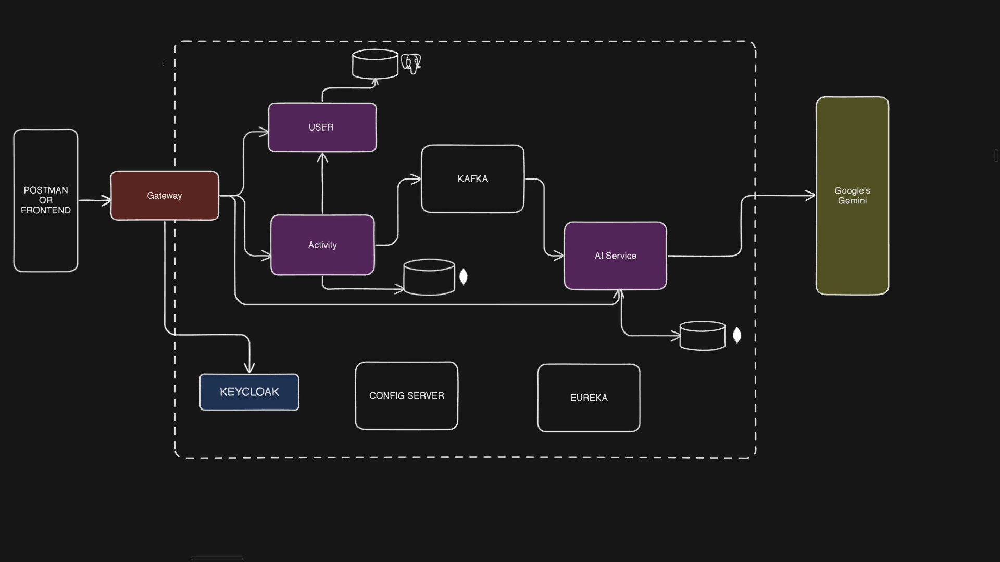

🏋️‍♂️ Fitness Microservice System (AI-Powered Recommendations)
🚀 Overview

A scalable Fitness Microservice System designed to manage users, workouts, and health data, enhanced with AI-powered recommendations.

This system leverages modern backend architecture using Spring Boot microservices and integrates with Gemini API to provide personalized fitness suggestions based on user activities.

🧠 Key Features
👤 User Management Service
🏃 Activity Tracking Service
🤖 AI-Based Fitness Recommendations
🌐 API Gateway for centralized routing
📡 Service Discovery using Eureka
⚙️ Centralized Configuration Server
💬 RESTful APIs for communication
📊 Scalable Microservice Architecture
🧩 Microservices Architecture

This project is divided into the following services:

User Service → Handles user data and profiles
Activity Service → Tracks workouts and fitness activities
AI Service → Generates recommendations using Gemini API
API Gateway → Routes requests to appropriate services
Eureka Server → Service discovery
Config Server → Centralized configuration
🤖 AI Recommendation System

The system integrates Gemini API to provide intelligent fitness suggestions.

🔍 How it works:
User logs activities (e.g., running, gym, yoga)
Data is stored via Activity Service
AI Service fetches activity data
Gemini API processes user patterns
Personalized recommendations are returned

💡 Example Recommendations:
Suggested workout plans
Calorie burn insights
Fitness improvement tips

🛠️ Tech Stack
Backend

Java
Spring Boot
Spring Cloud
Spring Security
Microservices Tools
Eureka Server
API Gateway
Config Server
Database
MySQL/PostgreSQL/MongoDB
AI Integration
Gemini API
Dev Tools
Docker (optional)
Git & GitHub

📂 Project Structure
fitness-microservice/
│
├── userservice
├── activityservice
├── aiservice
├── gateway
├── eureka
├── configserver
├── fitness-app-frontend
└── README.md

⚙️ Setup & Installation
1️⃣ Clone the repository
git clone https://github.com/your-username/fitness-microservice.git
cd fitness-microservice

2️⃣ Start Services in Order
Config Server
Eureka Server
All Microservices
API Gateway

3️⃣ Configure Gemini API Key
Add your API key in:
application.properties / application.yml

Example:
gemini.api.key=YOUR_API_KEY

🔗 API Endpoints (Sample)
User Service
POST /users
GET /users/{id}

Activity Service
POST /activities
GET /activities/user/{userId}

AI Recommendation Service
GET /ai/recommend/{userId}

📈 Future Enhancements
🔐 JWT Authentication
📱 Frontend Dashboard (React/Angular)
📊 Advanced analytics & reports
🧠 Improved AI personalization
☁️ Deployment on AWS / GCP
👨‍💻 Author

Jayansh Gupta
Backend Developer | Java & Spring Boot Enthusiast

⭐ Contributing

Contributions are welcome!
Feel free to fork this repo and submit a pull request.